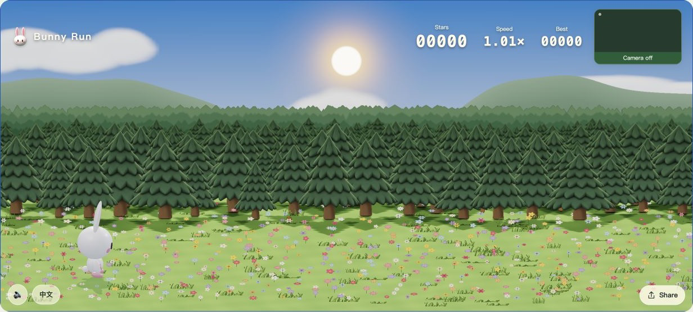
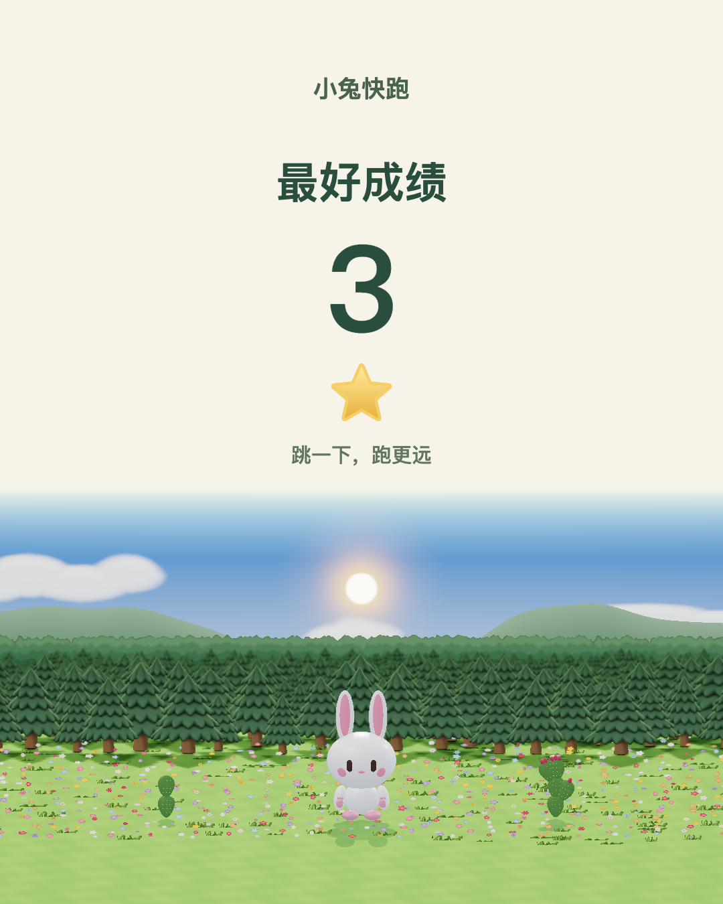

<div align="center">

# Bunny Run · 小兔快跑

**A little bunny. A field of flowers. One more jump.**<br>
**穿过花海，跃过仙人掌，再跳一次。**

<p>
  <a href="https://guigulaoshi.github.io/bunny-run/"></a>
  <a href="https://guigulaoshi.itch.io/bunny-run"></a>
</p>

Play in your browser · 打开即玩 · No install · 无需安装<br>
Jump with your body or press **Space** · **体感跳跃 / 空格操作**

<a href="https://guigulaoshi.github.io/bunny-run/"></a>

</div>

## Hop in · 开始跑吧

A playful 3D endless runner with a springy bunny, floating carrots and branching cacti. Start gently, find your rhythm, and keep up as the meadow rolls by faster.

一只软弹的小兔子，在花海里追逐胡萝卜、跳过仙人掌。从轻松的开场开始，找到节奏，迎接越来越快的挑战。

本项目基于并感谢原项目 [Bunny Run](https://github.com/guigulaoshi/bunny-run) 改造。

| | Keyboard · 键盘 | Camera · 体感 |
|---|---|---|
| **Start · 开始** | Press Space · 按空格 | Jump once · 原地跳一次 |
| **Jump · 跳跃** | Press Space · 按空格 | Jump in place · 原地起跳 |
| **Try again · 重来** | Press Space after a fall · 摔倒后按空格 | Jump once after a fall · 摔倒后跳一次 |

**No camera? No problem.** Space works on its own. For motion play, use an ordinary webcam, allow camera access and stand still briefly to calibrate. Your head or upper body can be enough; your feet do not need to be visible. Choose a clear space to move.

**没有摄像头也能玩。** 直接按空格即可。体感模式使用普通摄像头，授权后短暂站稳完成校准；头部或上半身入镜即可，不要求拍到脚。请在开阔的位置活动。

## Little jumps, bright rewards · 每一跳都有惊喜

<table>
<tr>
<td width="63%" valign="top">

### 🥕 Catch a carrot · 吃颗胡萝卜

One carrot, one star. Miss one and keep running.<br>
吃到一颗加一星，错过也不会失败。

### ⭐ Time your jump · 跳得刚刚好

Clear a cactus for stars. Larger obstacles and a well-centered jump earn more.<br>
越过仙人掌获得星星，障碍大小和起跳时机决定奖励。

### 🌼 A moving miniature world · 会呼吸的小世界

Flowers, layered forests, rolling hills, drifting clouds and sunlight that changes the shadows.<br>
花海、层叠树林、起伏远山，还有会遮住阳光的流云。

### 🐰 Share your best · 分享最好成绩

Save a picture of your best score, featuring the bunny and scenery from the game.<br>
把最好成绩变成一张图片，带上游戏里的兔子和风景。

</td>
<td width="37%" align="center" valign="middle">
<br>
<sub>In-game share card · 游戏内分享卡示例</sub>
</td>
</tr>
</table>

English and Chinese follow your browser language, with a manual switch. Camera processing stays on your device; no microphone is needed.

中英文默认跟随浏览器，也可以手动切换。摄像头画面仅在本机处理，不需要麦克风。

<details>
<summary><b>Run locally · 本地运行</b></summary>

Use Node.js 22 or newer. / 使用 Node.js 22 或更新版本。

```sh
npm ci
npm run dev
```

To build the static game: / 生成静态游戏：

```sh
npm run build
```

</details>

## Use it, make it yours · 欢迎使用和改编

Code: [MIT](LICENSE). Original artwork: [CC BY 4.0](ASSET-LICENSE). You may use and adapt them, including commercially, with the required attribution and license notices. Third-party assets retain their own licenses; see [notices](licenses/NOTICE).

代码使用 MIT 许可，原创美术使用 CC BY 4.0。欢迎使用、修改和商用，请按许可保留署名及许可声明。第三方资源遵循各自许可。

<p align="center">
  <b>Made by <a href="https://github.com/guigulaoshi">guigulaoshi</a></b><br>
  <a href="https://guigulaoshi.github.io/bunny-run/">Play Bunny Run · 开始游戏</a> · <a href="https://guigulaoshi.itch.io">More games · 更多游戏</a>
</p>
